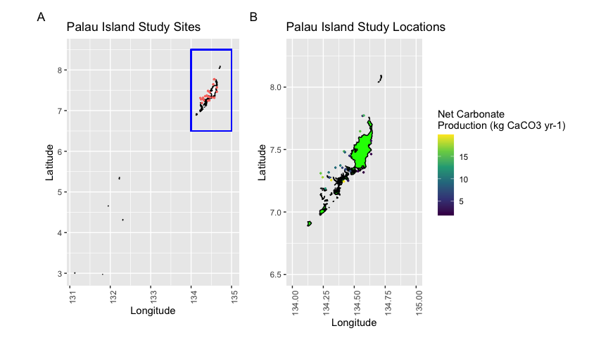
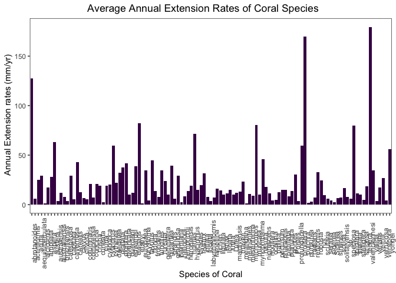
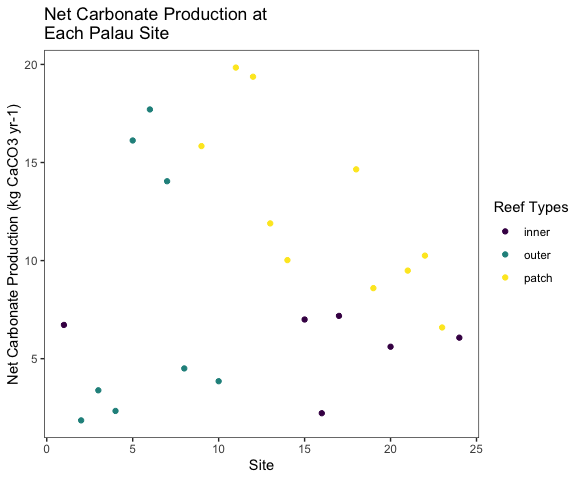
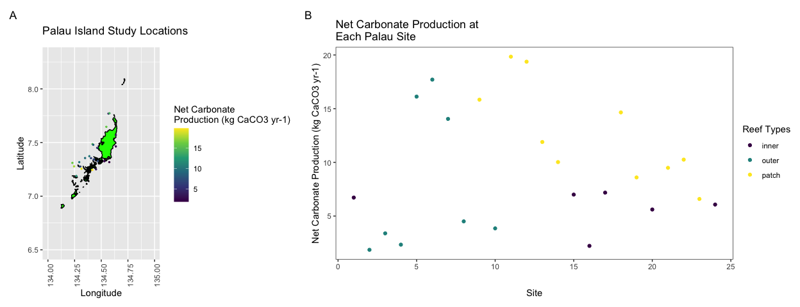

Palau’s Coral Carbonate Production and Relation to Growth Potential
================
Emily Buono
7/17/2020

## Coral’s Carbonate Production Rates around Palau

## Research Question

What is the Net Carbonate Production of multiple species of Coral at
several research sites around Palau, and how does this relate back to
the coral’s growth potential?

Coral reefs play important parts in ocean environment, as well as acting
as buffers for islands from tropical storm waves. Coral is a main
contributor in the production of CaCO3, which plays a key role in reef
framework construction. High percentage coral cover can mean high rates
of CaCO3 accumulation and possibly rapid reef growth potential
(Cacciapaglia & van Woesik, 2018). It is unknown how coral reefs and
their carbonate production will respond to sea-level rise climate
change. The goal of the paper this project is based on was to measure
potential net carbonate production rates across different reef habitats
in Palau and Yap and figure out which habitats are more likely to keep
up with sea-level rise (Cacciapaglia & van Woesik, 2018).

Palau is a country made of several outer islands and a main island. It
is located in the western Pacific Ocean. Palau will be focused on in
this project due to the fact that Yap’s map was not available to work
with and visualize.

### Required Packages

These are the required R packages to ensure the smooth running of this
project’s code.

``` r
library(ggplot2)
library(raster)
library(dplyr)
library(tidymodels)
library(patchwork)
```

### Loading The Data

These data utilized is from the Biological & Chemical Oceanography Data
Management Office. Three different data sets are downloaded here, and a
map of the Palau Islands as well. Later some of these data tables are
merged to be able to use in visualizations.

``` r
coral <- read.csv('http://dmoserv3.bco-dmo.org/jg/serv/BCO-DMO/Coral_Reef_Adjustment/extension_rates.flat0?', sep = "", na.strings = c('nd', 'encrusting'))

sites_data <- read.csv('http://dmoserv3.bco-dmo.org/jg/serv/BCO-DMO/Coral_Reef_Adjustment/site_list.flat0?', sep = "", na.strings = c('nd'))

model_data <- read.csv('http://dmoserv3.bco-dmo.org/jg/serv/BCO-DMO/Coral_Reef_Adjustment/model_output.flat0?',sep = "", na.strings = c('nd'))

palau = getData('GADM', country='Palau', level = 0)

head(coral)
```

    ##      genus    species  min  max Annual_Extension growth_form density
    ## 1 Acropora hemprichii <NA> <NA>          15.0380   branching      NA
    ## 2 Acropora hemprichii <NA> <NA>           6.2780   branching      NA
    ## 3 Acropora hemprichii <NA> <NA>           5.8035   branching      NA
    ## 4 Acropora hemprichii <NA> <NA>           4.7450   branching      NA
    ## 5  Porites        sp. <NA> <NA>          10.0860     massive      NA
    ## 6  Porites      lutea   12   21          15.2000     massive      NA

``` r
head(sites_data)
```

    ##   country site study_site     lat      lon
    ## 1   Palau    1          N 7.33967 134.4296
    ## 2   Palau    2          D 7.31716 134.5753
    ## 3   Palau    3          G 7.57015 134.6366
    ## 4   Palau    4          F 7.46360 134.6367
    ## 5   Palau    5          E 7.30995 134.2290
    ## 6   Palau    6          H 7.27801 134.2451

``` r
head(model_data)
```

    ##   Country locat     NP     GP      BFj      BUj      lon     lat
    ## 1   Palau outer  4.503  3.834 0.032741 0.004210 134.5675 7.76951
    ## 2   Palau outer 14.046 12.087 0.005237 0.000000 134.5770 7.77253
    ## 3   Palau outer  3.851  2.778 0.005566 0.001773 134.4509 7.25032
    ## 4   Palau outer  1.855  1.522 0.008019 0.001087 134.5753 7.31716
    ## 5   Palau outer 16.123 13.483 0.049035 0.000724 134.2290 7.30995
    ## 6   Palau outer  2.336  2.040 0.039665 0.007066 134.6367 7.46360

The data includes 24 study sites around Palau.

### Filtering Data

To plot the data of NP onto a map of Palau, the data must be filtered to
just show Palau sites. Dplyr pipes were utilized in this code.

``` r
palau_sites_data <- sites_data %>% filter(country == 'Palau')
palau_model_data <- model_data %>% filter(Country == 'Palau')
```

## Figure 1: Palau Maps with Site Data

Figure 1 features a full map of Palau and several of its smaller
islands. The site locations are marked as red points. Figure 2 has more
centered Latitude and Longitude axes to focus in on where the studies
actually occurred. The sites are marked on figure 2’s green Palau map by
points colored by their corresponding NP values with a viridis hue
scale.

``` r
zoomed_out <- ggplot() + geom_polygon(data=palau, aes(x=long, y=lat, group=group), fill= "white" , color= "black") + 
  geom_point(data=palau_model_data, aes(x=lon, y=lat, color = 'red'), size = 0.5) + coord_quickmap() + geom_rect(data=palau_model_data, aes( xmax = 135, xmin = 134, ymin =6.5, ymax = 8.5,  alpha = 0.5), fill = NA ,color = 'blue' ) + labs( y = 'Latitude' , x = 'Longitude',  title = 'Palau Island Study Sites') + theme(axis.text.x  = element_text(angle=90), legend.position = 'none')

sites_location_map_p <- ggplot() + 
  geom_polygon(data=palau, aes(x=long, y=lat, group=group), fill= "green" , color= "black") + 
  xlim(134, 135) + ylim(6.5, 8.3)+ theme(axis.text.x  = element_text(angle=90)) + 
  geom_point(data=palau_model_data, aes(x=lon, y=lat,color = NP), size = 0.5) + 
  coord_quickmap() + theme(axis.text.x  = element_text(angle=90)) + labs( x= 'Longitude', y = 'Latitude', title = 'Palau Island Study Locations', col = 'Net Carbonate 
Production (kg CaCO3 yr-1)') + scale_colour_viridis_c()

combined_maps <- zoomed_out + sites_location_map_p + plot_layout(ncol =2) +
  plot_annotation(tag_levels = "A") 
print(combined_maps)
```

<!-- -->

## Figure 2: Coral Species and their Average Annual Extension Rates

The Annual Extensions rates (mm/yr) were measured for each species of
coral, and in this code the averages were taken and visualized. The
extension rates varied greatly, showing that coral growth potential
could also be affected by species as well.

``` r
coral_ext_rates = coral %>% group_by(species) %>% summarise(avg = mean(Annual_Extension)) %>% na.omit()
head(coral_ext_rates)
```

    ## # A tibble: 6 x 2
    ##   species            avg
    ##   <chr>            <dbl>
    ## 1 abrotanoides     128. 
    ## 2 actiniformis       5.7
    ## 3 acuta             25  
    ## 4 aequituberculata  29  
    ## 5 alcicornis         1.2
    ## 6 ampliata          17.4

``` r
ggplot()+ geom_col(data= coral_ext_rates, aes(x = species, y = avg, fill = 'blue')) + labs(x = 'Species of Coral', y = ' Annual Extension rates (mm/yr)', title = '                    Average Annual Extension Rates of Coral Species') +theme_test()+ theme(axis.text.x  = element_text(angle=90),legend.position = 'none') + scale_fill_viridis_d()
```

<!-- -->

### New Data Frame

A new data frame was made combining model\_data and sites\_data by using
the merge function on the latitude and longitude columns. The data frame
was also filtered specifically for Palau.

``` r
sites_and_models <- merge(model_data, sites_data ,by=c("lat","lon"))
palau_sites_and_models <- sites_and_models %>% filter(country == 'Palau', Country == 'Palau')
head(palau_sites_and_models)
```

    ##       lat      lon Country locat     NP     GP      BFj      BUj country site
    ## 1 7.18776 134.2667   Palau patch 11.896 10.112 0.003314 0.000000   Palau   13
    ## 2 7.24448 134.4161   Palau patch 19.840 15.214 0.006687 0.000000   Palau   11
    ## 3 7.25032 134.4509   Palau outer  3.851  2.778 0.005566 0.001773   Palau   10
    ## 4 7.25530 134.3144   Palau patch 19.373 15.036 0.001710 0.000170   Palau   12
    ## 5 7.27646 134.3011   Palau inner  6.997  5.105 0.018992 0.000083   Palau   15
    ## 6 7.27801 134.2451   Palau outer 17.705 14.822 0.006176 0.000614   Palau    6
    ##   study_site
    ## 1          W
    ## 2          V
    ## 3          C
    ## 4          X
    ## 5          I
    ## 6          H

## Figure 3: Net Productions at Each Site, and Colored by Reef Type

As seen in this figure, the Net Carbonate production varied greatly for
each reef type, but the inner reefs seemed to stay fairly low in
comparison to the outer and patch reefs, at around 1-7 kg CaCO3 yr-1.

``` r
npvssite_scatterplot <- ggplot() + geom_point(data = palau_sites_and_models, aes( x= site, y = NP, color = locat )) +
  labs( x = 'Site', y = 'Net Carbonate Production (kg CaCO3 yr-1)', title = 'Net Carbonate Production at 
Each Palau Site', col= 'Reef Types') + scale_colour_viridis_d() +theme_test()
print(npvssite_scatterplot)
```

<!-- -->

## Figure 4: Palau Study Locations as well as NPs at Each Site

Figure 4 combines the map plot of Palau with the scatter plot of site
and Net Production of Carbonate (kg CaCO3 yr-1), giving the opportunity
to compare the two visualizations, seeing where exactly the studies
occurred and the corresponding carbonate production.

``` r
map_and_np_locats <- sites_location_map_p + npvssite_scatterplot + plot_layout(ncol =2) +
  plot_annotation(tag_levels = "A") 
print(map_and_np_locats)
```

<!-- -->

## Conclusions

As seen in figure 4, the inner reefs produce on average less Net
Carbonate than the outer and patch reefs. This could mean that, since
coral is a main contributor in the production of CaCO3, which plays a
key role in reef framework construction, those inner reefs would need a
higher coral cover to make the same quantity of carbonate as the other
reefs and be as sturdy as them (Cacciapaglia & van Woesik, 2018). Figure
2 shows that extension rates and growth potential can also be in part
due to species. So overall the study suggests that the innermost reefs
are the most vulnerable to sea-level rise and climate-change-induced
stress, and the species that grow the least may be at the most risk.
Inner coral species need to grow more to be able to handle the stress
more effectively, but are not producing enough carbonate to be able to
grow like the outer and patch reefs. The outer and patch reefs are more
capable to handle the changes and grow, but still are at risk due to how
rapid changes are occurring in this day and age.

### Citations

‘dplyr’ (Van Woesik and Cacciapaglia 2018)

<https://www.bco-dmo.org/dataset/737526>

<div id="refs" class="references">

<div id="ref-van2018keeping">

Van Woesik, Robert, and Christopher William Cacciapaglia. 2018. “Keeping
up with Sea-Level Rise: Carbonate Production Rates in Palau and Yap,
Western Pacific Ocean.” *PloS One* 13 (5): e0197077.

</div>

</div>
